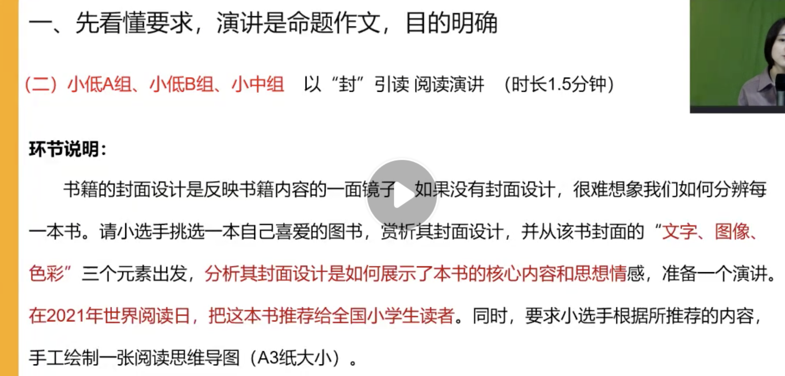
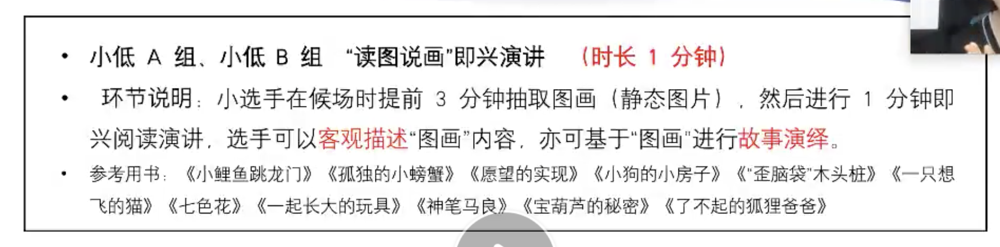
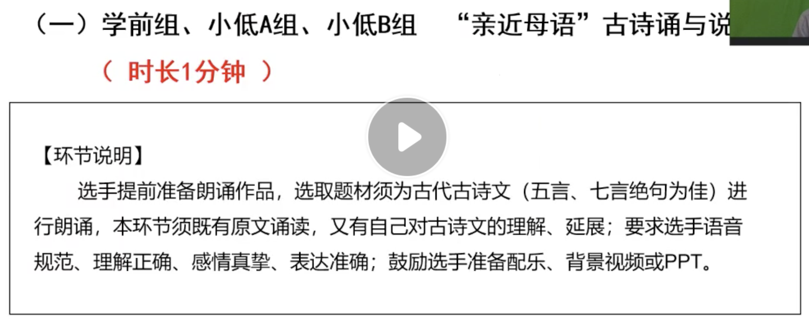

# 1. 资料收集

- [1. 资料收集](#1-资料收集)
  - [1.1. 以封引读1.5分钟](#11-以封引读15分钟)
  - [1.2. 读图说画1分钟](#12-读图说画1分钟)
  - [1.3. 亲近母语1分钟](#13-亲近母语1分钟)

## 1.1. 以封引读1.5分钟

- 2021年世界阅读日 4月23日

## 1.2. 读图说画1分钟

- 小鲤鱼跳龙门-完成
  - 小鲤鱼跳龙门 11张图
  - 蝴蝶有一面小镜子 7张图
  - 小猫钓鱼 12张图
  - 骄傲的大公鸡 8张
  - 狐狸打猎人的故事 12张
- 孤独的小螃蟹
- 愿望的实现
- 小狗的小房子-完成
- 歪脑袋木头桩
- 一只想飞的猫
- 七色花
- 一起长大的玩具
- 神笔马良
- 宝葫芦的秘密-完成
- 了不起的狐狸爸爸-完成

## 1.3. 亲近母语1分钟

